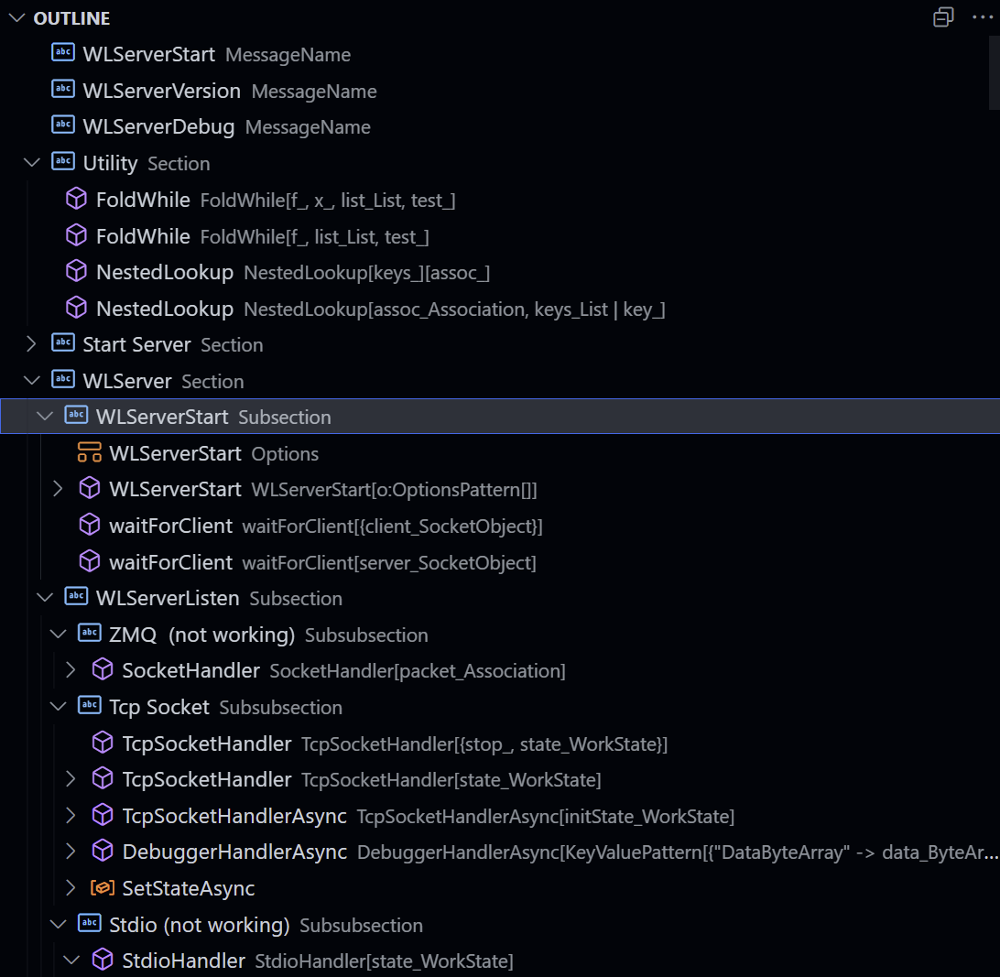
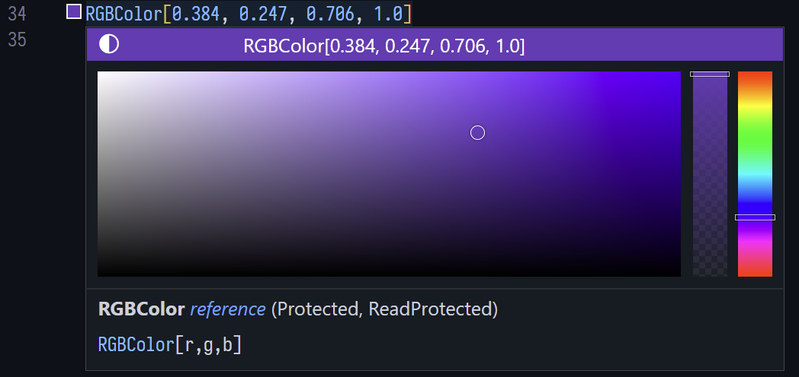

# Wolfram Language Server

[](http://www.wolfram.com/language/)
[](https://opensource.org/licenses/MIT)


> by [kenkangxgwe](https://github.com/kenkangxgwe) and [hxianglong](https://github.com/huxianglong) 

<!-- markdown-toc start - Don't edit this section. Run M-x markdown-toc-refresh-toc -->
**Table of Contents**

- [Wolfram Language Server](#wolfram-language-server)
    - [Installation](#installation)
    - [Run the Server](#run-the-server)
    - [Features](#features)
    - [Contribute](#contribute)
        - [Design Principles](#design-principles)
        - [Todo list](#todo-list)
    - [Donations :dollar:](#donations-dollar)
    - [Footnotes](#footnotes)

<!-- markdown-toc end -->

**Wolfram Language Server (WLServer)** is an implementation of the Microsoft's
[Language Server Protocol
(LSP)](https://microsoft.github.io/language-server-protocol) for [Wolfram
Language](http://www.wolfram.com/language). This server is
implemented in Wolfram Language itself.

Our current goal is to provide the experience as good as the Mathematica FrontEnd 
with addition power from the editor.

We have provided the client-side code for VS Code [here](https://github.com/kenkangxgwe/vscode-lsp-wl), which is based on some slight
modifications of [Microsoft's LSP
example](https://github.com/Microsoft/vscode-extension-samples/tree/master/lsp-sample).
If you are using other editors supporting LSP, some adaptation to the
client would certainly work too.

## Installation

0. [Wolfram Mathematica](http://www.wolfram.com/mathematica/) (11.2 or higher<a
    name="ref1"></a>[<sup>1</sup>](#footnote1)) or [Wolfram
    Engine](https://www.wolfram.com/engine/) (12.0 or higher).

1. Use git to clone this repository.  
    ``` sh
    git clone https://github.com/kenkangxgwe/lsp-wl.git
    ```

2. Install the dependent paclets with the correct versions (currently 0.15.1)
from the Wolfram kernel / Mathematica.
(_This will cost some time for the first time_) :  
    ``` mathematica
    PacletInstall["AST", "UpdateSites" -> True]
    PacletInstall["Lint", "UpdateSites" -> True]
    ```

3. Install the client. Currently, we provide the VS Code extension on [Visual
Studio Marketplace: Wolfram Language Server](https://marketplace.visualstudio.com/items?itemName=lsp-wl.lsp-wl-client)

## Run the Server

Clients can start the server by running the `init.wls` file from Wolfram
Mathematica executables

``` sh
wolfram -script /path/to/lsp-wl/init.wls [args]
# or
wolframscript -f /path/to/lsp-wl/init.wls [args]
```

The posible arguments for the server are

- `--help, -h` to print help information.
- `--socket=port` to assign the port to which the server will connect. (Default:
`6536`)
- `--tcp-server=port` to assign the port at which the server will start. (Default:
`6536`)
- `--pipe=pipename` to specify the pipe name for the server to connect to.
- `--log=level, -l level` to specify the logging level of the server.
  (Levels: `error`, `warn`, `info`, `debug`. Default: `info`)
- `--test, -t` to run the unit test for the server.

If you want to run the server from Mathematica you can use the following code.

``` mathematica
initfile = "/path/to/lsp-wl/init.wls";
args = {};
Block[{$ScriptCommandLine = Prepend[args, initfile], Quit = Function[{}, Throw[Null]]},
    Catch[<< (initfile)]
];
```

This is a good way to see the results from the unit tests.

## Features

- **DocumentSymbol:** You may typeset your package in the same way that
  Mathematica FrontEnd handles it: a cell begins with two lines of comments,
  where the first line specifies the style of the cell and the second line names it.
  So you may get the outline structure of the file.
  
  ``` mathematica
  (* ::Title:: *)
  (*Title of the file*)

  (* ::Section:: *)
  (*Section 1*)
  ```
  
  

- **Hover:** Provide documentations for functions and variables from the
  ``System` `` context, such as `String` and `$Path`, the `MessageName` and
  the special numerical literals with `^^` or `*^`.

  

- **Completion:** The completion is shown by the client automatically.
  Functions and system variables from the ``System` `` context that matches the
  input would be displayed. To enter an unicode character, you may use the
  leader key <kbd>\\</kbd> followed by the alias just like <kbd>esc</kbd> in
  Wolfram FrondEnd. E.g., `<esc>a` in the FrontEnd is input as `\a` in the
  editor and the server will show you the available completions.

  

- **Completion Resolve:** Further information (such as documentation) would be
  provided for the items in the list.

  

- **Diagnostics:** Syntax error would be underlined. This feature is powered by
  Brenton's `AST` and `Lint` paclets, thank you
  [@bostick](https://github.com/bostick).

  

- **Definition / References / DocumentHighlight:** It is now able to look up the
  definition and references of a local variable in a scope such as `Module` or
  pattern rules.

  

- **Document Color / Color Presentation:** Both Named Colors and
  Color Models with constant parameters are able to show and modify.  
  (_Experimental, may have performance issues._)

  

This is an early release, so more features are on the way. Notice that,
syntax highlight will not be provided as long as it is excluded in the LSP,
but I believe there are plenty of good Mathematica highlighter available for
your editor.

Here is a full list of [LSP features](https://microsoft.github.io/language-server-protocol/specification).

## Contribute

### Design Principles

1. The files are located according to its context name. The `init.wls` is the
   entry script that parses the commandline arguments, loads packages
   and starts the server.

2. We implemented an stateless server in ``WolframLanguageServer`Server` `` that
   will parse and handle the messages.

3. ``DataType` `` is a simple type system now extracted as a independent
  package in the [Matypetica](https://github.com/kenkangxgwe/Matypetica)
  library that supports pattern test on every field of a class. The operations
  on the objects are designed to be immutable.

4. ``WolframLanguageServer`Test`* `` stores the unit tests for some of
   the functions.

### Todo list

It will be nice if you want to make a contribution to the following topic.

* Our server-client communication only supports Socket with TCP protocol. We
  tried to use ZMQ_Stream protocol and `SocketListen[]` to enable concurrency,
  but it fails to send responses back to the client.

* It will be helpful to implement a stdio channel, ~so that the Mathematica
  earlier than 11.2 will also be supported,~ but it is really hard to expose
  the `stdin` channel. Hope this will be dicussed in future release of Wolfram
  kernel.

* More editor clients are needed. You can feel free to open a repository and
  create a pull request to add the clients in README.md once your client is
  released.

* Thanks to Brenton's `AST` and `Lint` paclets, we are able to parse the code
  and extract useful information. If you have an idea about how to use these
  fantastic syntax tools to help the language server add more features, please
  send us issues or pull requests.

If you want to help us with this project, feel free to fork and create a pull
request. Do not forget to add unit tests if possible.

## Donations :dollar:

If you really like this project, please donate to us! **$5 (or equivalently
￥35)**. A cup of coffee :coffee: would certainly
brighten our day! Your donation would be the motivation for us to move forward,
thanks in advance :smile:.

- Paypal: qwe95123@126.com
- Alipay (With QRCode): 13916018006  


## Footnotes

<a name="footnote1"> </a> **[1]** `SocketListen[]` is used for server-client
communication, which is introduced since 11.2. [^](#ref1)
